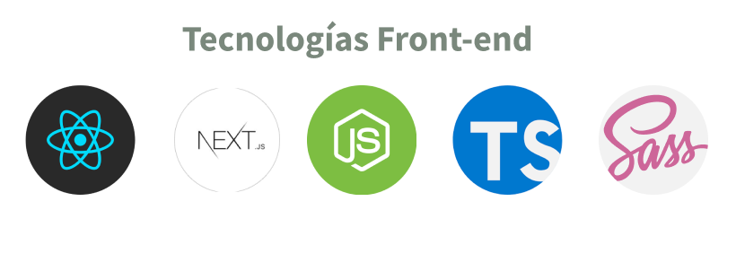

# Project Frontend
{: .no_toc }

## Table of contents
{: .no_toc .text-delta }

1. TOC
{:toc}

---

# Documentación del Proyecto Frontend

Nuestro repositorio se encuentra en: 
https://github.com/escuelavirtual/frontend

## Tecnologias implementadas

### ¿Por que React?

- Nos ofrece bastante flexibilidad a la hora de trabajar con diversos stacks.
- Es usado por grandes empresas como Facebook, Netflix, Instagram entre otros.
- Tiene una documentación en español excelente.
- Versatilidad con el virtual DOM.
- Facilidad de adaptar nuestra web a dispotivivos móviles con React Native.
- Cuenta con una gran comunidad de usuarios facilitando su aprendizaje.
- Es Open Source.

**Mas Información en: [https://es.reactjs.org/](https://es.reactjs.org/)**

### ¿Porqué NextJs?

- No necesita una configuración.
- Híbrido: SSG y SSR.
- Generación estática incremental.
- Soporta TypeScript.
- Edición en vivo rápida y confiable.
- Enrutamiento del sistema de archivos.
- Rutas API
- Soporte CSS y Sass
- División y agrupación del código

‼️**Mas Información: [https://nextjs.org/](https://nextjs.org/)**

### ¿Porqué Node.js?

- Está basado en el motor V8 de Chrome (Uno de los mas avanzados)
- Operaciones de entrada y salida sin bloqueos.
- Orientado a Eventos.
- Es liviano y eficiente.
- Nos facilita el desarrollo con paquetes propios de Node (Express, Koa, happy, etc)
- Nos facilita la integración de sockets.

**Mas información: [https://nodejs.org/es/](https://nodejs.org/es/)**

### ¿Porqué Typescript?

- Se puede escalar de una forma óptima tanto en proyectos medianos como en grandes.
- Lenguaje de tipado fuerte, lo que permitirá mantener mejor el código.
- Se complementa perfectamente con VS Code, dándonos ayudas, autocompletado, etc
- Curva de aprendizaje muy baja si sabes Javascript.
- Lenguaje desarrollado por Microsoft.
- Integración fácil con otros editores diferentes a VS Code.
- Lenguaje Open Source.
- Cuenta con uno de los repositorios más activos de Github.
- Es usado por grandes empresas: La misma Microsoft, Skype, Slack entre otros.
- Podemos usar todo lo que hemos aprendido con JavaScript.
- Podemos usar el lenguaje orientado a objetos más optimamente.
- Se puede trabajar con Interfaces y Genéricos.
- Se maneja mucho mejor el tema de Herencia con respecto a JavaScript.
- Chequeo de errores en tiempo de ejecución.

**Mas información: [https://www.typescriptlang.org/](https://www.typescriptlang.org/)**

### ¿Porqué Sass?

- Reduce el tiempo para crear y mantener mi CSS.
- Permite una organización modular de los estilos.
- Proporciona estructuras de lenguajes de programación.
- Permite generar distintos tipos de salida CSS de manera automática.
- Herramientas, librerías, comunidad etc. 

‼️ **Mas información: [https://sass-lang.com/](https://sass-lang.com/)**

## Metodologías

### Estructura de archivos / Patrón 7 en 1 Sass

Utilizaremos este patrón para estructurar las carpetas de una forma mas organizada y que a la larga sea mas fácil mantener el código.

[Estructura de Archivos / Patron 7 - 1 SASS](https://sass-guidelin.es/#architecture)

### Storybook

Usaremos Storybook para poder testear los diferentes componentes que iremos creando y para que podamos tener una vista rápida de como van quedando estos componentes.

[Storybook](https://storybook.js.org/)

### Atomic Design

Se utilizará la metodología de diseño, Atomic Desing.

**Atomic design** es una metodología compuesta por cinco etapas distintas que trabajan juntas para crear sistemas de diseño de interfaces de una manera más deliberada y jerárquica. Las cinco etapas de **atomic design** son:

-  Atoms
-  Molecules
-  Organisms
-  Templates
-  Pages

Puedes encontrar una referencia mas detallada en

[https://atomicdesign.bradfrost.com](https://atomicdesign.bradfrost.com/)
